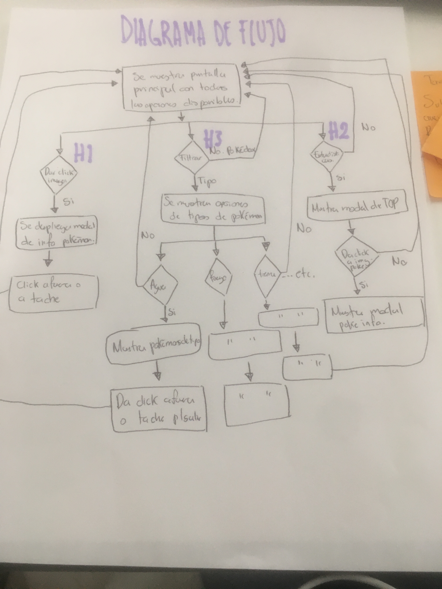
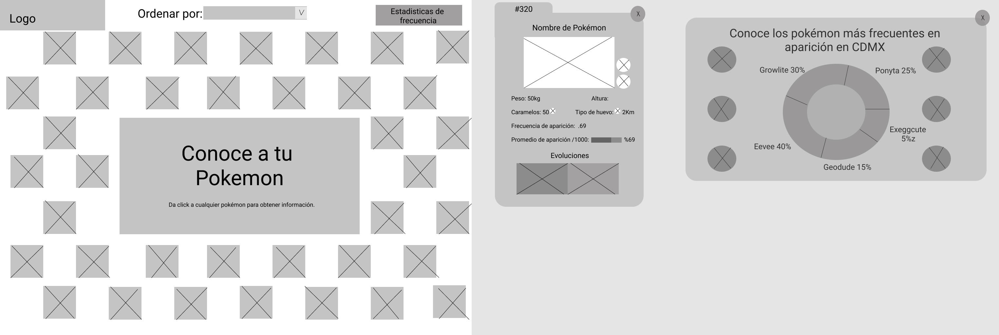

# YouDex

YouDex es una página web drigida a personas de 18 a 20 años que juegan Pokemon Go y requieren información de forma más rapida y eficiente sobre sus pokemons, también tendrá la opción de filtrar su busqueda por tipo de pokemon o por numero de Pokedex. 

## Historia de Usuario

El usuario quiere saber las características de cada pokemon dde forma más visual y ordenar por tipo.

### Prototipo de baja fidelidad (sketch)

#### Wireframe

## 3. Objetivos de aprendizaje

El objetivo principal de este proyecto es que, entendiendo las necesidades de
tus usuarios, aprendas a diseñar y construir una interfaz web donde se pueda
visualizar y manipular data.

Revisa la lista y reflexiona sobre los objetivos que conseguiste en el
proyecto anterior. Piensa en eso al decidir tu estrategia de trabajo individual
y de equipo.

### UX

- [ ] Diseñar la aplicación pensando y entendiendo al usuario.
- [ ] Crear prototipos para obtener _feedback_ e iterar.
- [ ] Aplicar los principios de diseño visual (contraste, alineación, jerarquía).
- [ ] Planear y ejecutar _tests_ de usabilidad.

### HTML y CSS

- [ ] Entender y reconocer por qué es importante el HTML semántico.
- [ ] Identificar y entender tipos de selectores en CSS.
- [ ] Entender como funciona `flexbox` en CSS.
- [ ] Construir tu aplicación respetando el diseño planeado (maquetación).

### DOM

- [ ] Entender y reconocer los selectores del DOM (querySelector | querySelectorAll).
- [ ] Manejar eventos del DOM. (addEventListener)
- [ ] Manipular dinámicamente el DOM. (createElement, appendchild, innerHTML, value)

### Javascript

- [ ] Manipular arrays (`filter` | `map` | `sort` | `reduce`).
- [ ] Manipular objects (key | value).
- [ ] Entender el uso de condicionales (`if-else` | `switch`).
- [ ] Entender el uso de bucles (`for` | `forEach`).
- [ ] Entender la diferencia entre expression y statements.
- [ ] Utilizar funciones (parámetros | argumentos | valor de retorno).
- [ ] Entender la diferencia entre tipos de datos atómicos y estructurados.
- [ ] Utilizar ES Modules (`import` | `export`).

### Pruebas Unitarias (_testing_)
- [ ] Testear funciones (funciones puras).

### Git y GitHub
- [ ] Ejecutar comandos de git (`add` | `commit` | `pull` | `status` | `push`).
- [ ] Utilizar los repositorios de GitHub (`clone` | `fork` | gh-pages).
- [ ] Colaborar en Github (pull requests).

### Buenas prácticas de desarrollo
- [ ] Organizar y dividir el código en módulos (Modularización).
- [ ] Utilizar identificadores descriptivos (Nomenclatura | Semántica).
- [ ] Utilizar linter para seguir buenas prácticas (ESLINT).